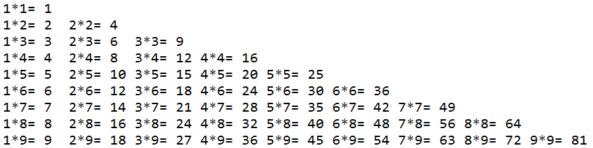

## 技术部考核

> 说明：本次考核共5道题目，答对3题（含）以上者为合格，不合格者建议转到其他部门		
> 要求：在Eclipse中新建项目，以自己名字的全拼命名，答题完成后将项目导出为.zip压缩文件，通过邮箱发送到liuchenglu2016#hotmail.com（将#换成@）	
> 时间：2016.11.23 （周三） 22：30 至 2016.11.27 （周日） 20：00	
> 地点：不限	

+ `1、求 1+3+5+7+……+99 的和,在控制台输出`

+ `2、给定一个百分制的数字，输出相应的等级`

> 90分以上 A级	
 80~89 B级		
 70~79 C级		
 60~69 D级		
 60分以下 E级		

+ `3、输入一个年份，判断是否是闰年`

> 判断输入的年份是否为闰年
	闰年的判断规则如下：       
	i. 若某个年份能被4整除但不能被100整除，则是闰年       
	ii. 若某个年份能被400整除，则也是闰年

+ `4、打印九九乘法表`

+ `5、打印下图`

